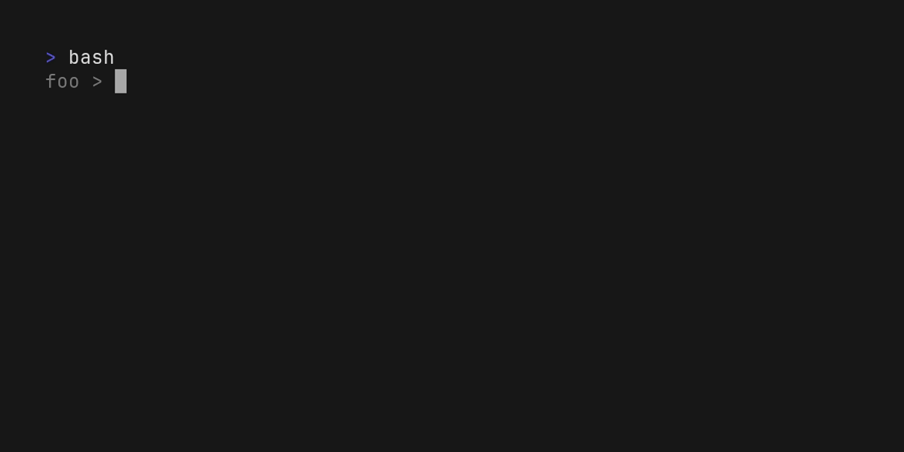
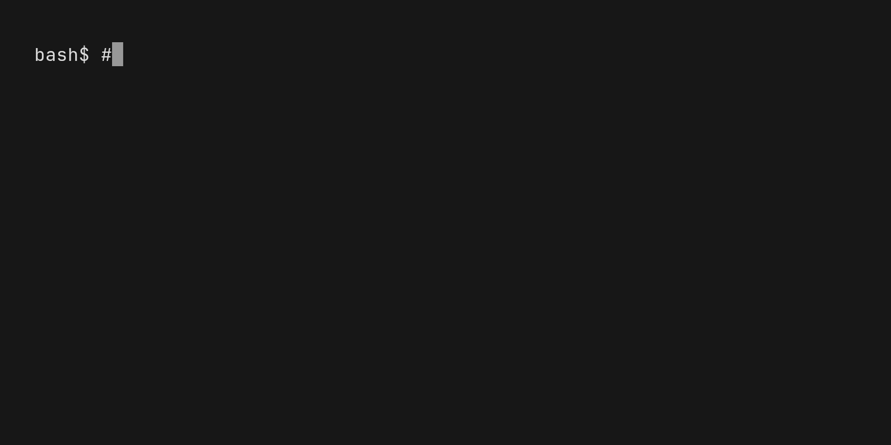

# Flyline

<div align="center">

[](https://github.com/HalFrgrd/flyline/actions/workflows/ci.yml)
[](https://github.com/HalFrgrd/flyline/blob/main/LICENSE)
[](https://github.com/HalFrgrd/flyline/releases)



</div>

A bash plugin for modern command line editing. Flyline replaces readline to provide a code-editor-like experience and other features:
- Undo and redo support
- Cursor animations
- Fuzzy history suggestions
- Fuzzy autocompletions
- Integration with bash autocomplete
- Mouse support:
    - Click to move cursor in buffer
    - Hover over command for tooltips
- Tab completions when writing subshells, command substitutions, process substitutions
- Tab completions for aliases (e.g. if `gc` aliases to `git commit`, `gc --verbo<TAB>` works as expected)
- Tooltips
- Auto close brackets and quotes
- Syntax highlighting


# Installation
Download the latest `libflyline.so`.
In your `.bashrc` (or in your current bash session):
```bash
enable -f /path/to/libflyline.so flyline
flyline --tutorial-mode
```


# Integrations
## VS Code:
- I'd recommend setting `terminal.integrated.minimumContrastRatio = 1` to prevent the cell's foreground colour changing when it's under the cursor.
- You may want to set `terminal.integrated.macOptionIsMeta` so `Option+<KEY>` shortcuts are properly recognised.
- Shell integration WIP (https://github.com/HalFrgrd/flyline/issues/52)

## macOS
`Command+<KEY>` shortcuts are often captured by the terminal emulator and not forwarded to the shell.
Two possible fixes are:
- Map `Command+<KEY>` to`Control+<KEY>` in your terminal emulator settings.
- Use a terminal emulator that supports [Kitty's exteneded keyboard protocol](https://sw.kovidgoyal.net/kitty/keyboard-protocol/). This allows flyline to receive `Command+<KEY>` events.

# Rich prompts

Flyline supports dynamic content in `PS1`, `RPS1` / `RPROMPT`, and `PS1_FILL`.

## Setting your prompt
- The `PS1` environment variable sets the left prompt just like normal. See [bash prompt documentation](https://www.gnu.org/software/bash/manual/html_node/Controlling-the-Prompt.html) for more information or [starship integration](#starship-integration).
- `RPS1` / `RPROMPT` sets the right prompt similarly to zsh.
- `PS1_FILL` fills the gap between the `PS1` and `RPS1` lines.

For instance:


## Starship integration
TODO:
Starship provides customizable prompts for any shell. The git metrics prompt part is very useful but can slow down the time it takes to generate the prompt. Because Flyline can redraw the prompt, it can asynchronously load the slower widgets in the background to keep the shell feeling snappy 

## Dynamic time in prompts

Flyline recognises the standard bash time escape sequences and re-evaluates them on every prompt draw, so the time shown is always current:

| Sequence       | Output                          |
|----------------|---------------------------------|
| `\t`           | 24-hour time — `HH:MM:SS`       |
| `\T`           | 12-hour time — `HH:MM:SS`       |
| `\@`           | 12-hour time with am/pm         |
| `\A`           | 24-hour time — `HH:MM`          |
| `\D{format}`   | Custom format (see below)       |

These can be placed in any of the supported prompt variables:

```bash
# Right prompt showing 24-hour time in green
export RPROMPT='\[\033[01;32m\]\t\[\033[0m\]'

# Right prompt showing 12-hour am/pm time
export RPROMPT='\[\033[01;34m\]\@\[\033[0m\]'
```

### Custom time format with `\D{format}`

Use `\D{format}` with any [Chrono format string](https://docs.rs/chrono/latest/chrono/format/strftime/index.html) to display the time exactly how you want it. This is similar to `\D{format}` in the [bash prompt documentation](https://www.gnu.org/software/bash/manual/html_node/Controlling-the-Prompt.html), but the format string is interpreted by Chrono rather than strftime.

```bash
# Show date and time
export RPROMPT='\[\033[01;32m\]\D{%Y-%m-%d %H:%M:%S}\[\033[0m\]'

# Show only hours and minutes
export RPROMPT='\D{%H:%M}'
```
